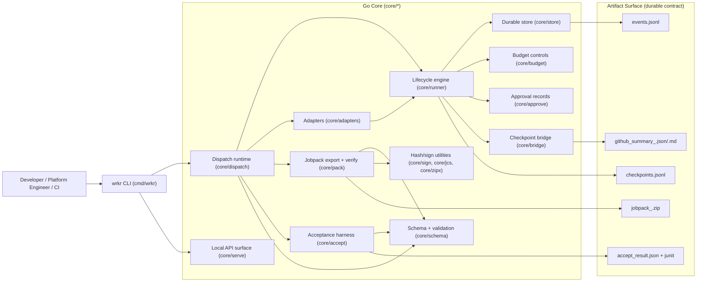

# Wrkr Architecture

This document is the canonical architecture view for Wrkr OSS v1.

## Component Architecture

## Runtime Boundaries

- Authoritative boundary: Go core owns status transitions, checkpoint semantics, budget/approval gates, export/verify integrity, and exit codes.
- Adoption boundary: wrappers/SDK integrations are transport layers and should not replace core state or contract logic.
- Durable contract boundary: schemas + persisted artifacts are the long-lived API, not in-memory structs.

## State and Persistence

- Default store root: `~/.wrkr/`
- Per-job state:
  - append-only event log (`events.jsonl`)
  - periodic snapshot (`snapshot.json`)
  - runtime execution cursor (`runtime_config.json`)
- Deterministic artifact root: `./wrkr-out/`
  - `jobpacks/`
  - `reports/`
  - `integrations/`

## Failure Posture

- Lease + heartbeat prevents concurrent double execution on a single job claim.
- Environment mismatch on resume blocks by default (`E_ENV_FINGERPRINT_MISMATCH`) unless explicitly overridden.
- Budget violations emit deterministic blocked checkpoints (`E_BUDGET_EXCEEDED`).
- Verify fails closed on hash mismatch, missing files, or undeclared entries.
- Serve defaults to loopback; non-loopback requires explicit hardening inputs.
