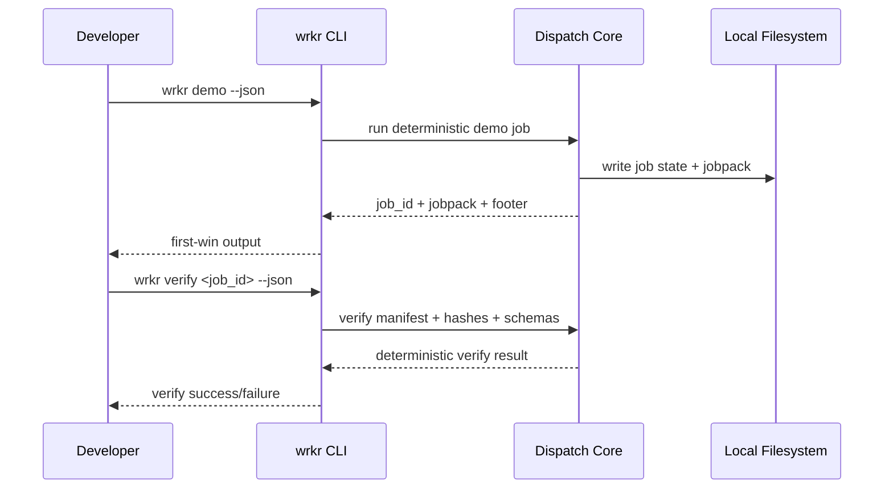
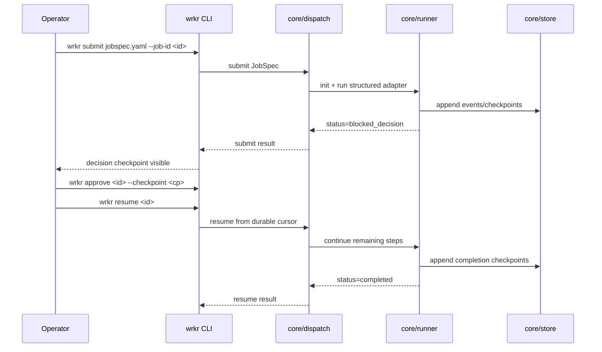
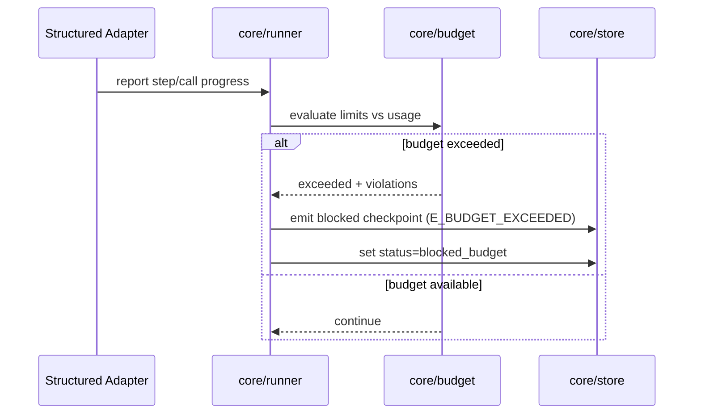
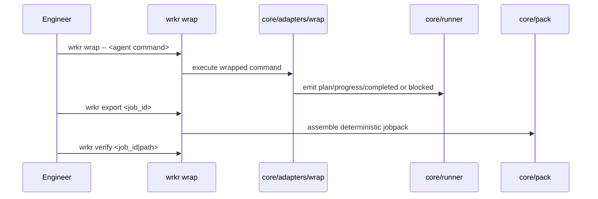
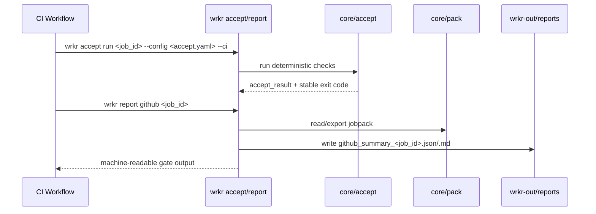
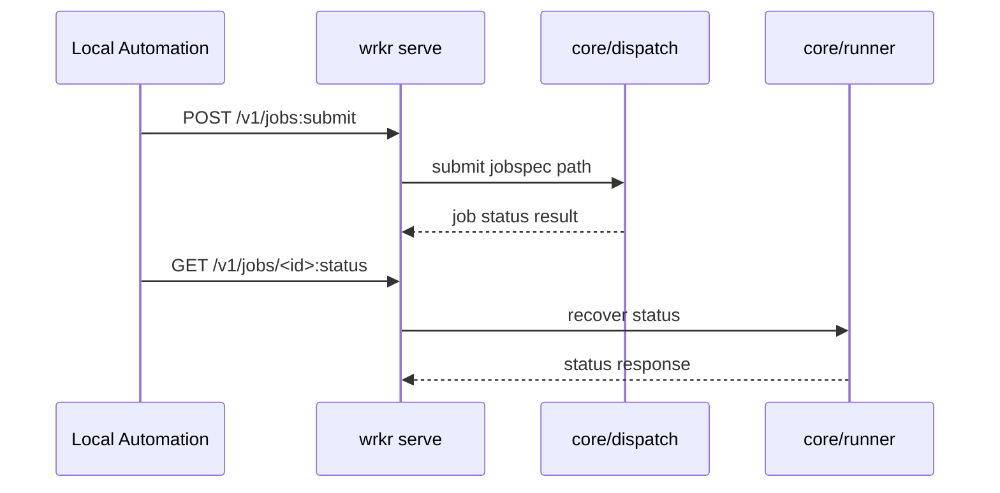

# Wrkr Flow Diagrams

This document is the canonical runtime flow reference for Wrkr OSS v1.

## 1) First-Win Flow (Demo -> Verify)

Value: produces a verifiable artifact in under one minute with no external dependencies.

## 2) Structured Dispatch With Decision Checkpoint

Rule: resume continues from persisted `next_step_index` and does not replay completed steps.

## 3) Budget Stop Condition

## 4) Wrap Adoption Flow

Wrap gives zero-integration adoption and still lands on the same jobpack/verify contract.

## 5) Acceptance + CI Gate

## 6) Local Serve API Transport

Hardening rule: non-loopback serve requires explicit allow + auth token + body limit.
